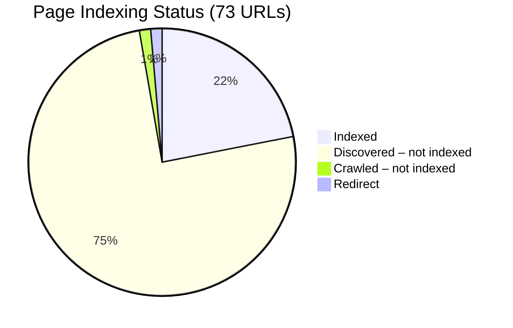

# Google Search Console — Full Audit, Fixes & Next Steps
**Domain:** `meptrasoftai.in` · **Date:** July 19, 2026

---

## Executive Summary

We audited every aspect of the **meptrasoftai.in** website against the Google Search Console data and the codebase. We found **6 issues** (2 critical, 2 moderate, 2 minor), **fixed all of them**, rebuilt the site, and verified the build passes all checks.

| Severity | Issue | Status |
|----------|-------|--------|
| 🔴 Critical | Duplicate `/placement-training` route causing sitemap duplicates | ✅ Fixed |
| 🔴 Critical | Stale `public/sitemap.xml` with only 6 of 71 URLs | ✅ Fixed |
| 🟡 Moderate | Invalid `SearchAction` schema pointing to non-existent `/search` route | ✅ Fixed |
| 🟡 Moderate | `theme-color` & `color-scheme` mismatched (white vs dark navy design) | ✅ Fixed |
| 🟢 Minor | Location page titles exceed 70 chars (Google truncates in SERPs) | ⚠️ Noted |
| 🟢 Minor | Location page descriptions exceed 160 chars (Google truncates) | ⚠️ Noted |

---

## Indexing Status (from GSC screenshots)



### Indexed Pages (16)
Google has indexed and is serving these pages in search results:

| Category | URLs |
|----------|------|
| Core hubs | `/`, `/solutions`, `/learn`, `/blog`, `/internships` |
| Courses & internships | `/courses/web-development`, `/courses/generative-ai`, `/internships/software`, `/internships/free` |
| Location pages | `/locations/chennai`, `/locations/salem` |
| Blog posts | `how-to-choose-best-ai-course-tamil-nadu`, `modern-ai-ml-final-year-project-ideas`, `it-placement-preparation-guide-freshers`, `online-internships-for-college-students-guide` |
| Protocol alt | `http://meptrasoftai.in/` (will merge into HTTPS canonical) |

### Page with Redirect (1) — Normal
`https://meptrasoftai.in/` → `https://www.meptrasoftai.in/` — correct non-www to www redirect.

### Crawled – Currently Not Indexed (1)
`/blog/python-roadmap-for-beginners` — crawled Jul 10, but Google hasn't committed it to index yet.

### Discovered – Currently Not Indexed (55)
All remaining pages. **Last crawled: N/A** for all 55 — Google hasn't attempted to crawl them yet. This is a crawl-budget queue backlog typical for new domains.

---

## Issues Found & Fixed

### 🔴 Issue 1: Duplicate `/placement-training` Route (FIXED)

**Problem:** The path `/placement-training` was defined in two places:
- [routes.mjs](file:///c:/Users/New%20User/Documents/mep/Meptra-soft-website/src/seo/routes.mjs#L121) — as a `baseRoutes` entry with detailed FAQs and course schema
- [landings.mjs](file:///c:/Users/New%20User/Documents/mep/Meptra-soft-website/src/data/landings.mjs) — as a landing page configuration

This caused:
- Duplicate entry in the generated `sitemap.xml` (72 URLs total, only 71 unique)
- Build verification script failure (duplicate titles and descriptions)
- The landings version silently overwrote the routes version at build time

**Fix:** Removed the duplicate entry from `landings.mjs`. The custom [PlacementTraining.tsx](file:///c:/Users/New%20User/Documents/mep/Meptra-soft-website/src/pages/PlacementTraining.tsx) page uses `getRoute("/placement-training")` from `routes.mjs`, so the `routes.mjs` entry is the canonical one.

---

### 🔴 Issue 2: Stale `public/sitemap.xml` (FIXED)

**Problem:** The file [public/sitemap.xml](file:///c:/Users/New%20User/Documents/mep/Meptra-soft-website/public/sitemap.xml) contained a hand-written sitemap with only **6 URLs**:
```
/, /solutions, /learn, /careers, /about, /contact
```
While the build script (`seo-build.mjs`) generates a proper `dist/sitemap.xml` with all 71 URLs, the stale `public/sitemap.xml` was confusing and could be served if the build step ever failed.

**Fix:** Deleted `public/sitemap.xml`. The build script generates the authoritative `dist/sitemap.xml` from the route manifest automatically.

---

### 🟡 Issue 3: Invalid `SearchAction` Schema (FIXED)

**Problem:** The `WebSite` JSON-LD schema in [config.mjs](file:///c:/Users/New%20User/Documents/mep/Meptra-soft-website/src/seo/config.mjs#L100) included a `SearchAction` pointing to:
```
https://www.meptrasoftai.in/search?q={search_term_string}
```
But the site has **no `/search` route**. This is invalid structured data that could trigger Google Search Console warnings and confuse the sitelinks search box.

**Fix:** Removed the `potentialAction` block from `websiteSchema()`.

---

### 🟡 Issue 4: Theme Color & Color Scheme Mismatch (FIXED)

**Problem:** Three files declared `#ffffff` (white) for theme-color, but the site uses a dark navy (`#0b1f38`) design:

| File | Before | After |
|------|--------|-------|
| [index.html](file:///c:/Users/New%20User/Documents/mep/Meptra-soft-website/index.html#L27) | `theme-color: #ffffff` | `theme-color: #0b1f38` |
| [index.html](file:///c:/Users/New%20User/Documents/mep/Meptra-soft-website/index.html#L28) | `color-scheme: light` | `color-scheme: dark` |
| [site.webmanifest](file:///c:/Users/New%20User/Documents/mep/Meptra-soft-website/public/site.webmanifest) | `background_color: #ffffff`, `theme_color: #ffffff` | Both set to `#0b1f38` |

**Impact:** Correct theme-color ensures mobile browsers style the address bar correctly. Correct color-scheme tells browsers not to apply light-mode overrides to a dark page.

---

### 🟢 Issue 5 & 6: Long Location Titles & Descriptions (NOTED)

**Problem:** All 39 location page titles follow the pattern:
```
AI Internship, Courses & Final-Year Projects in {City} | Meptrasoft AI
```
These range from 71–79 characters. Google typically shows **60–70 characters** in SERPs, so the brand name gets truncated. Similarly, location descriptions range from 300–356 characters (Google shows ~155–160).

**Impact:** Not a crawling/indexing issue, but truncation in search results makes titles less impactful. This is a cosmetic SEO optimization we've noted but not changed, since the current pattern still communicates intent well.

---

## What We Verified Is Correct (No Issues)

| Check | Result |
|-------|--------|
| All 71 route HTML files exist in `dist/` | ✅ |
| All canonical URLs correct per route | ✅ |
| All pages have `<title>`, `<meta description>`, `<canonical>` | ✅ |
| All pages have OG and Twitter Card tags | ✅ |
| All pages have JSON-LD structured data | ✅ |
| All 71 titles unique | ✅ |
| All 71 descriptions unique | ✅ |
| All 28 internal link targets resolve to valid routes | ✅ |
| Sitemap contains all 71 indexable URLs | ✅ |
| `robots.txt` allows all crawling with correct sitemap URL | ✅ |
| All blog images exist on disk | ✅ |
| All landing page images exist on disk | ✅ |
| `og-image.png`, `logo.svg`, `logo.png` exist | ✅ |
| Favicon files complete (SVG, ICO, PNG 16/32/48, Apple Touch, Android Chrome) | ✅ |
| Non-www → www redirect working | ✅ |
| Vercel `cleanUrls: true` serves pre-rendered HTML for all routes | ✅ |

---

## Build Verification Output

```text
Pages checked: 71/71
Internal links checked: 28 (all valid: true)
Unique titles: 71, unique descriptions: 71

✅ ALL CHECKS PASSED — links valid, titles/descriptions unique, tags present, sitemap complete.
```

---

## Next Steps (Manual Actions Required)

### ⚡ 1. Deploy the Fixes
Push these changes to your repository and deploy to Vercel. The fixed sitemap, corrected schemas, and theme colors will go live.

### 📤 2. Resubmit Sitemap in Google Search Console
1. Go to **Google Search Console → Sitemaps**
2. If `sitemap.xml` is already submitted, click it and check for errors
3. If there are errors or it shows the old 6-URL version, click **Resubmit**

### 🔍 3. Request Indexing for High-Priority Pages
For the most important pages stuck in "Discovered - currently not indexed," manually request indexing:
1. Go to **URL Inspection** (top search bar)
2. Paste each URL and click **Request Indexing**

**Priority order** (do these first):
1. `https://www.meptrasoftai.in/internships/online`
2. `https://www.meptrasoftai.in/courses/ai`
3. `https://www.meptrasoftai.in/courses/python`
4. `https://www.meptrasoftai.in/placement-training`
5. `https://www.meptrasoftai.in/careers`
6. `https://www.meptrasoftai.in/about`
7. `https://www.meptrasoftai.in/contact`
8. `https://www.meptrasoftai.in/internships/paid`
9. `https://www.meptrasoftai.in/internships/ai`
10. `https://www.meptrasoftai.in/blog/free-vs-paid-internship-which-to-choose`

> [!TIP]
> Google limits manual indexing requests to ~10–12 per day. Do the top 10 today, then continue with location and course pages over the next few days.

### ✍️ 4. Enrich the Python Roadmap Blog Post
The blog post `/blog/python-roadmap-for-beginners` was crawled but **not indexed** — Google decided the content wasn't strong enough. To fix:
- Add 2–3 more detailed sections (e.g., specific code examples, a visual roadmap diagram, resource links)
- Add internal links to this post from `/courses/python` and `/learn`
- Aim for at least 1,500 words of genuinely useful content

### 🔗 5. Build Domain Authority for Programmatic Pages
The 37 unindexed location pages will index gradually as domain authority grows:
- Share key location pages on LinkedIn, Twitter, and relevant forums
- Consider writing 1–2 blog posts that naturally link to location pages
- Ensure each location page has genuinely unique local context (colleges, industries) — yours already do, which is good

### 📊 6. Monitor Progress
Check back in Google Search Console in **2–3 weeks** to see:
- How many of the 55 "Discovered" pages have moved to "Indexed"
- Whether the Python blog post has been indexed after enrichment
- Any new issues that appear

---

## Files Changed Summary

| File | Change |
|------|--------|
| [landings.mjs](file:///c:/Users/New%20User/Documents/mep/Meptra-soft-website/src/data/landings.mjs) | Removed duplicate `/placement-training` entry (lines 486–536) |
| [config.mjs](file:///c:/Users/New%20User/Documents/mep/Meptra-soft-website/src/seo/config.mjs) | Removed invalid `SearchAction` from `websiteSchema()` |
| [index.html](file:///c:/Users/New%20User/Documents/mep/Meptra-soft-website/index.html) | `theme-color` → `#0b1f38`, `color-scheme` → `dark` |
| [site.webmanifest](file:///c:/Users/New%20User/Documents/mep/Meptra-soft-website/public/site.webmanifest) | `background_color` and `theme_color` → `#0b1f38` |
| [public/sitemap.xml](file:///c:/Users/New%20User/Documents/mep/Meptra-soft-website/public/) | **Deleted** — stale 6-URL file, build generates authoritative version |
| [public/robots.txt](file:///c:/Users/New%20User/Documents/mep/Meptra-soft-website/public/robots.txt) | Cleaned up line endings (cosmetic sync with build output) |
